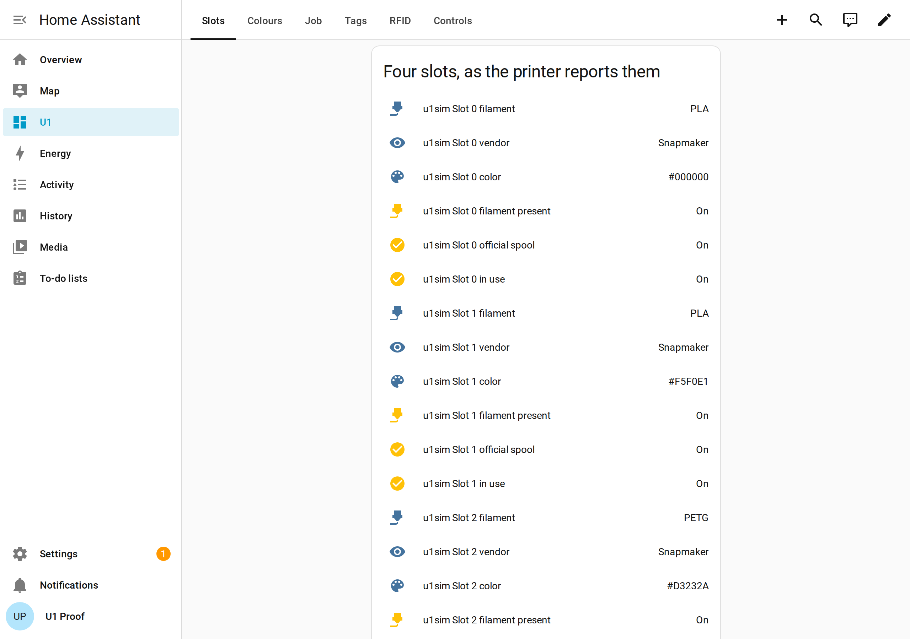
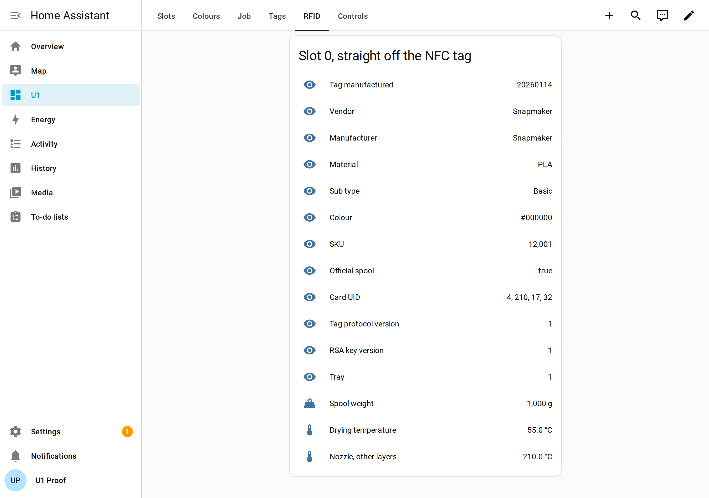
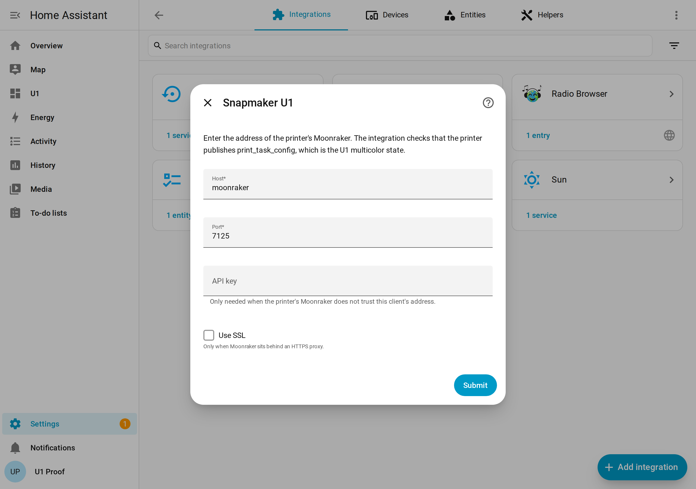

# U1 Companion

[](https://github.com/zkasuran/u1-companion/actions/workflows/ci.yml)

A Home Assistant integration for the Snapmaker U1, plus a simulator that lets
you run the whole thing without a printer.

The U1 has 4 physical toolheads and addresses up to 32 logical colors mapped
onto them. All of that lives in one Klipper printer object called
`print_task_config`, together with the filament identity the machine reads off
NFC tags. This project surfaces that in Home Assistant: four slots with type,
sub type, vendor, color and RFID identity, the logical color to head mapping,
print state and progress.

Two pieces in one repository:

- `custom_components/snapmaker_u1/` talks to Moonraker over HTTP plus the
  websocket and creates the entities. 82 of them on a four slot machine.
- `u1sim/` is a fake Klippy. It binds a Unix socket, speaks the real Klippy API
  protocol and serves real U1 payload shapes, so an unmodified
  `Snapmaker/U1-Moonraker` runs on top of it. That is what makes this
  demonstrable and testable with no hardware.

Both halves are checked against the real thing rather than against each other.
`scripts/prove-real-moonraker.sh` runs Snapmaker's own unpatched Moonraker on the
simulator and captures every byte it returns into `artifacts/`, the test suite
drives the integration's parsing with those captured bytes, and
`scripts/ha_live_proof.py` puts a live Home Assistant through the config flow
against that stack and checks all 82 entities. See Verification below.

## What it looks like

Four slots the way the printer reports them, plus one spool's whole NFC reading.

| Slots | One tag, field by field |
| --- | --- |
|  |  |

| The job | Setting it up |
| --- | --- |
|  |  |

Every one of those is a browser against a real Home Assistant with a real
Moonraker behind it, on simulated printer state. `docs/SCREENSHOTS.md` has the
rest of the set, including the payload the container answered with and a colour
remap landing live, plus the command that regenerates all of them.

## The gap this fills

Home Assistant already has a Moonraker integration and it is a good one. It is
also written for a generic Klipper printer. The widely used
[moonraker-home-assistant](https://github.com/marcolivierarsenault/moonraker-home-assistant)
picks up any object whose name starts with `extruder` for temperature plus
power, so a U1 shows four hotends, but it has no `print_task_config`, no
`filament_detect`, no `extruder_map_table` and nothing for RFID filament
identity. Its filament sensors are `print_stats.filament_used`, one total in mm,
plus an optional width sensor. Checked against its `custom_components/moonraker/`
source on 2026-08-15.

So on a U1 the parts that make it a U1 are missing: which of the four slots are
loaded, what material each one holds, what color, whether the spool is a
verified Snapmaker one, which heads this job uses, how 32 logical colors map down
to 4 heads. Those are the things you want on a wall panel next to the printer.
This integration adds exactly that layer.

Nothing needs patching on the printer side to get there. Moonraker has no
Klipper object allowlist. Grepping the whole `u1-moonraker` tree for
`print_task_config` returns nothing, because Moonraker forwards whatever the
caller asked for and returns whatever Klippy answered
(`u1-moonraker/moonraker/components/klippy_apis.py:41`, forwarding at
`components/klippy_connection.py:674`). So `print_task_config` and
`filament_detect` are readable from a stock U1 with no firmware change and no
config change.

## Architecture

```
  Home Assistant
  +---------------------------------------------+
  |  custom_components/snapmaker_u1             |
  |    config flow: host, port, optional API key|
  |    HTTP  GET /printer/objects/query   once  |
  |    WS    printer.objects.subscribe    live  |
  |    merges partial status pushes into state  |
  +----------------------+----------------------+
                         | HTTP 7125 + ws /websocket
                         v
  +---------------------------------------------+
  |  Moonraker, unmodified Snapmaker/u1-moonraker|
  +----------------------+----------------------+
                         | Unix socket, JSON framed by 0x03
                         v
  +---------------------------------------------+
  |  either the real U1 Klippy                  |
  |  or  u1sim, this repo                       |
  |      info, list_endpoints, objects/list,    |
  |      objects/query, objects/subscribe,      |
  |      gcode/script                           |
  |      pushes changed fields at 4 Hz          |
  +---------------------------------------------+
```

The socket protocol is not a guess. Klippy frames each JSON document with a
single trailing `0x03` byte, with no length prefix and no newline
(`u1-klipper/klippy/webhooks.py:247` for the read side, `:288` for the write
side). Moonraker matches that with `readuntil(b'\x03')`
(`u1-moonraker/moonraker/components/klippy_connection.py:194`). `docs/PROTOCOL.md`
has the full surface with a citation per claim, including the handshake
Moonraker performs on connect and the simulator acceptance checklist.

## Quickstart with no printer

Requires Docker with the compose plugin. Moonraker is not vendored here, so
clone Snapmaker's fork first. Nothing patches it.

```bash
git clone https://github.com/zkasuran/u1-companion
cd u1-companion
git clone https://github.com/Snapmaker/U1-Moonraker vendor/u1-moonraker
docker compose up -d
```

Two containers come up, `u1sim` and `u1-moonraker`. Moonraker starts first and
waits for the simulator's socket, which is how a real printer boots too. It is
healthy once it has a ready Klippy behind it:

```bash
docker compose ps
# NAME           SERVICE     STATUS
# u1-moonraker   moonraker   Up (healthy)
# u1sim          u1sim       Up
```

`scripts/prove-docker-compose.sh` runs that whole sequence unattended: it brings
the pair up, waits for the healthcheck and then for the simulated job to start,
captures what the containers returned into `artifacts/docker-compose/` and checks
it. That is the script CI runs.

Then read the payload yourself:

```bash
curl 'http://localhost:7125/printer/objects/query?print_task_config'
curl 'http://localhost:7125/printer/objects/query?filament_detect&print_stats&virtual_sdcard'
```

The first call returns the four slot arrays. Port 7125 is Moonraker's own
default on this fork (`u1-moonraker/lava/moonraker.conf:3`) and the config in
`docker/moonraker.conf` keeps the fork's own `trusted_clients` block, so a LAN
client needs no API key. The integration keeps an optional API key field for
anyone who tightened that.

Drive the state to see the integration follow it live:

```bash
# move logical color 5 onto physical head 2
curl -X POST 'http://localhost:7125/printer/gcode/script?script=SET_PRINT_EXTRUDER_MAP%20CONFIG_EXTRUDER=5%20MAP_EXTRUDER=2'
# read the mapping back
curl -X POST 'http://localhost:7125/printer/gcode/script?script=GET_PRINT_EXTRUDER_MAP'
```

Both commands are the printer's own. They are registered at
`u1-klipper/klippy/extras/print_task_config.py:112` to `:115`, the setter
rejects an out of range index and refuses while a print is running
(lines 511 to 526), so expect an HTTP 400 carrying the firmware's message if
you send it mid print.

Home Assistant is in an optional profile, so add it when you want the full
stack on `http://localhost:8123`:

```bash
docker compose --profile ha up -d
```

The compose file mounts the integration into that container read only, so a
code change needs a Home Assistant restart rather than a rebuild.

If the fork is checked out somewhere else, point `MOONRAKER_SRC` at it:

```bash
MOONRAKER_SRC=../u1-moonraker docker compose up -d
```

### Without Docker

`scripts/prove-real-moonraker.sh` does the same thing with a venv instead of
containers, then captures everything the fork returned into
`artifacts/real-moonraker/`. That directory is committed and the test suite
reads it, see Verification below.

```bash
MOONRAKER_SRC=../u1-moonraker scripts/prove-real-moonraker.sh --keep
```

`--keep` leaves both processes running so you can point Home Assistant at them.

## Add it to Home Assistant

1. Copy `custom_components/snapmaker_u1/` into your Home Assistant
   `config/custom_components/` directory. HACS also works: add this repository
   as a custom repository of type Integration.
2. Restart Home Assistant.
3. Settings, Devices and services, Add integration, then search for
   **Snapmaker U1** (the name in `manifest.json`).
4. Enter the Moonraker host and port. Use `7125` unless you changed it. The API
   key is optional and only needed if your Moonraker is not trusting your Home
   Assistant host. There is an SSL option for a Moonraker behind a TLS proxy.

The config flow checks the connection and then checks that the printer really
publishes `print_task_config`, so pointing it at a generic Klipper printer fails
with a clear reason instead of creating 80 empty entities.

There is no discovery step. The fork's shipped config does run `[zeroconf]` with
`mdns_hostname U1` (`u1-moonraker/lava/moonraker.conf`), but the service type a
real U1 advertises has not been seen here, so guessing at one would be worse
than asking for the host.

The integration queries once over HTTP for a guaranteed full snapshot, then
subscribes over the websocket. That order is deliberate: a subscribe can be
answered out of Moonraker's own subscription cache on this fork
(`u1-moonraker/moonraker/components/klippy_connection.py:711` to `:763`), so the
query is what guarantees a complete starting state.

## Entities

One device per printer, 82 entities on a four slot machine. Slots are numbered 0
to 3 the way the firmware numbers its channels. Heads are numbered the same way.
Every row names the source field so you can check it against the printer
yourself.

Per slot, four times over:

| Entity | Platform | Source field |
| --- | --- | --- |
| Slot N filament | sensor | `print_task_config.filament_type[N]`, sub type and vendor as attributes |
| Slot N vendor | sensor | `print_task_config.filament_vendor[N]` |
| Slot N color | sensor, state is `#RRGGBB` | `print_task_config.filament_color_rgba[N]`, with alpha, the multi color list, the packed ARGB int and a `color_mismatch` flag as attributes |
| Slot N assigned colors | sensor, diagnostic | how many logical colors `print_task_config.extruder_map_table` points at this head, with the list and the whole table as attributes |
| Slot N job filament, estimated | sensor, grams | the sliced file's `filament_weight`, summed over the colors mapped here. Not a printer measurement, see below |
| Slot N spool weight | sensor, diagnostic | `filament_detect.info[N].WEIGHT` |
| Slot N drying temperature | sensor, diagnostic | `filament_detect.info[N].DRYING_TEMP` |
| Slot N recommended nozzle temperature | sensor, diagnostic | `filament_detect.info[N].OTHER_LAYER_TEMP`, first layer as an attribute |
| Slot N tag manufactured | sensor, diagnostic | `filament_detect.info[N].MF_DATE` as `YYYYMMDD`, with the whole RFID reading as attributes |
| Slot N scan state | sensor, diagnostic | `filament_detect.state[N]`, 0 idle, 1 detecting, 2 self testing |
| Slot N filament present | binary_sensor | `print_task_config.filament_exist[N]` |
| Slot N in use | binary_sensor | `print_task_config.extruders_used[N]` |
| Slot N official spool | binary_sensor | `print_task_config.filament_official[N]`, SKU as an attribute |

Per head, four times over:

| Entity | Platform | Source field |
| --- | --- | --- |
| Head N nozzle temperature | sensor, temperature | `extruder`, `extruder1`, `extruder2`, `extruder3`, target as an attribute |
| Head N dock state | sensor, diagnostic | the head's own `state`, `PARKED`, `ACTIVATE` or `UNKNOWN` |

Once per printer:

| Entity | Platform | Source field |
| --- | --- | --- |
| Print state | sensor, enum | `print_stats.state` |
| Progress | sensor, percent | `virtual_sdcard.progress` |
| Current file | sensor | `print_stats.filename` |
| Layer | sensor | `print_stats.info.current_layer`, total as an attribute |
| Print duration | sensor, duration | `print_stats.print_duration` |
| Total duration | sensor, duration | `print_stats.total_duration` |
| Filament used | sensor, length | `print_stats.filament_used`, one total in mm for the whole job |
| Active tool | sensor | `extruder*.extruder_index`, falling back to `toolhead.extruder` |
| Bed temperature | sensor, temperature | `heater_bed`, target as an attribute |
| Klipper state | sensor, diagnostic | `webhooks.state`, falling back to `/printer/info` |
| Machine state | sensor, diagnostic | `machine_state_manager.main_state`, decoded from its int, with `action_code` and the decoded `action` as attributes |
| Paused | binary_sensor | `pause_resume.is_paused` |
| Exception | binary_sensor, problem | `exception_manager.exceptions` |
| Auto replenish filament | switch | `print_task_config.auto_replenish_filament` |
| Filament entangle detection | switch | `print_task_config.filament_entangle_detect` |
| Replenish ignoring color | switch | `print_task_config.replenish_ignore_color` |
| Turn off LED at the end | switch | `print_task_config.end_led_turn_off` |
| Entangle detection sensitivity | select, low, medium, high | `print_task_config.filament_entangle_sen` |
| Pause, Resume, Cancel | button | `/printer/print/pause`, `resume`, `cancel` |
| Emergency stop | button | `printer.emergency_stop` over the websocket, which this fork refuses over HTTP (`u1-moonraker/moonraker/components/klippy_apis.py:77` to `:82`) |

The four switches and the select write through
`print_task_config/set_print_preferences`, which always answers HTTP 200 and puts
the outcome in the body (`print_task_config.py:181`, `:185`), so the integration
reads the body rather than trusting the status code.

There are no temperature number entities. `printer.control.extruder_temp` and
`printer.control.bed_temp` exclude the HTTP transport on this fork. A control
that silently fails is worse than one that is not there.

Four details worth knowing, because they come from reading the firmware rather
than from guessing at it.

**`"NONE"` means empty.** The firmware writes the literal string `NONE` into
`filament_vendor`, `filament_type` and `filament_sub_type` for an unknown slot
(`u1-klipper/klippy/extras/print_task_config.py:24` to `:26`). The integration
reports that as unknown instead of as a material called NONE. An untouched slot
also keeps colour `FFFFFFFF`, which reads as unknown rather than as a white
spool. A slot that does have an identity and really is white keeps `#FFFFFF`.

**Color has three representations that can disagree.** `filament_color` is an
ARGB integer, `filament_color_rgba` is eight hex characters as `RRGGBBAA` and
`filament_color_multi.colors` entries are six hex characters. On an RFID scan the
firmware copies the tag's `ARGB_COLOR` straight into `filament_color` while it
rebuilds `filament_color_rgba` from `RGB_1` plus `ALPHA`
(`print_task_config.py:325` to `:331`), so a tag where those disagree gives two
different answers. This integration reads `filament_color_rgba`, which is also
what the firmware repairs `filament_color_multi` from
(`print_task_config.py:228` to `:240`). When the two disagree the slot's
`color_mismatch` attribute says so rather than hiding it.

**Machine state arrives as a number.** `machine_state_manager.main_state` and
`action_code` are `IntEnum` members inside Klippy
(`machine_state_manager.py:9` to `:87`) and `get_status` returns the member
itself (`:322` to `:326`), so JSON hands a client the plain int. The integration
decodes both through the firmware's own tables. This is the one thing the
captured real payload caught that a hand written fixture had wrong.

**Per color grams are not in printer state.** The U1 does keep per logical
extruder `filament_used_g`, `filament_used_mm`, `nozzle_temp` and
`filament_flow_ratio`, but in a second dict, `DEFAULT_PRINT_TASK_CONFIG_2`
(`print_task_config.py:63` to `:75`). `get_status` returns
`self.print_task_config` only (line 503). There is no second printer object, so
Moonraker cannot see it. The honest source for per color usage is the sliced
file's metadata, which Moonraker parses into per filament lists
(`u1-moonraker/moonraker/components/file_manager/metadata.py:456` to `:462`) and
serves at `GET /server/files/metadata?filename=<path>`. That is what the
"estimated" slot sensors read. Their `source` attribute says `slicer_estimate`.
Anything claiming per color grams out of live printer state on this firmware is
wrong.

One unverified inference in that last one: the integration assumes
`filament_weight[i]` is logical color `i`, which follows from how the printer
numbers colors 0 to 31 but has not been checked against a file sliced by
Snapmaker's own slicer. If it turns out to be ordered differently, the per slot
grams are wrong and the fix is one line in `parsing.job_head_weights`.

## Services

Three services, each one a thin wrapper over a command the printer already has.
Each takes an optional `config_entry_id`, required only when more than one
printer is set up.

| Service | Fields | What it calls |
| --- | --- | --- |
| `snapmaker_u1.set_color_map` | `logical` 0 to 31, `head` 0 to 3 | `SET_PRINT_EXTRUDER_MAP CONFIG_EXTRUDER=<logical> MAP_EXTRUDER=<head>` |
| `snapmaker_u1.set_filament` | `slot` 0 to 3, `vendor`, `filament_type`, `sub_type`, optional `color`, optional `force` | `SET_PRINT_FILAMENT_CONFIG CONFIG_EXTRUDER=<slot> VENDOR=.. FILAMENT_TYPE=.. FILAMENT_SUBTYPE=.. [FILAMENT_COLOR_RGBA=..] [FORCE=1]` |
| `snapmaker_u1.send_gcode` | `script` | `POST /printer/gcode/script` |

Two firmware rules the services inherit rather than work around. The mapping
setter is refused while `print_stats.state` is `printing` or `paused`
(`u1-klipper/klippy/extras/print_task_config.py:511` to `:519`), which
`set_color_map` checks locally so you get the reason instead of a raw 400.
`SET_PRINT_FILAMENT_CONFIG` refuses to touch a slot holding official filament
unless `force` is set, it wants vendor plus type plus sub type together and any
write clears `filament_official` while zeroing `filament_sku` (lines 578, 589 to
591, 669 to 670). So overwriting a Snapmaker spool's identity is possible but it
costs the verified flag, which is the firmware's decision rather than this
project's.

Values are quoted so a vendor name with a space works
(`u1-klipper/klippy/gcode.py:284` to `:311`). `#`, `*` and `;` are rejected
instead of being sent, because Klipper cuts the command line at them (`:279` to
`:283`).

## Verification

Read this before judging the rest.

**No physical Snapmaker U1 was used to build or test this.** There is no
hardware in the loop anywhere in this repository and no claim here rests on a
printer having run. What was used is the simulator plus the real unmodified
Moonraker fork on top of it.

Commits under test: `Snapmaker/U1-Klipper` at `7eb3212` and
`Snapmaker/U1-Moonraker` at `3b8357c`, both 2026-07-30, read on 2026-08-15.

### What runs and what it proved

`scripts/prove-real-moonraker.sh` brings up Moonraker from the fork with the
fork's own pinned dependencies, starts u1sim behind it, then captures every
answer into `artifacts/real-moonraker/`. That directory is committed. It holds
raw payloads, the Moonraker log, the fork commit and the exact dependency
versions. Nothing in it is hand written.

Result of the last run:

- Moonraker reached `klippy_state: ready` with `klippy_connected: true`.
- 29 components loaded, including the four that only exist in Snapmaker's fork:
  `snapmakercloud`, `exception_manager`, `client_manager`, `repeater`.
- `failed_components: []`, `warnings: []`, `missing_klippy_requirements: []`.
- `GET /printer/objects/list` listed `print_task_config` and `filament_detect`
  among 32 objects.
- `GET /printer/objects/query?print_task_config` returned all four slot arrays
  and the 32 entry `extruder_map_table`.
- A colour remap posted over HTTP was accepted and showed up in printer state.
  An out of range one came back as HTTP 400 carrying the firmware's own message,
  `[print_task_config] extruder map, invalid extruder index!!!`.
- The websocket subscription delivered 60 `notify_status_update` frames in 32
  seconds, including `print_task_config` and `filament_detect` changes as the
  RFID scans landed.

`scripts/prove-docker-compose.sh` does the same thing through
`docker compose up -d`, which is what the quickstart above tells a reader to run.
Moonraker's healthcheck passed 5 seconds after `up` on this machine, with the
same empty `warnings` and `failed_components`. The payload it captured is taken
once the simulated job is running rather than at boot. Evidence is in
`artifacts/docker-compose/`.

### Home Assistant, driven end to end

`scripts/ha_live_proof.py` takes a throwaway Home Assistant, claims the owner
account over its own API, runs the integration's config flow against the
Moonraker container, waits for the coordinator and for the scenario to be mid
job, then reads every entity back out of `/api/states` and checks the values.
Nothing is mocked. The wait is for the state itself rather than a fixed sleep,
because the simulated timeline loops, so a slow Home Assistant boot would
otherwise be read against a print that had already finished.

Result, all 42 checks pass:

- The config flow created an entry and it loaded.
- 82 entities appeared: 59 sensors, 14 binary sensors, 4 switches, 4 buttons and
  1 select.
- None is unavailable. The eight that read unknown are the ones that should: slot
  3 has no RFID tag because it was written by G-code rather than scanned. Per
  colour grams need a sliced file's metadata that the simulator has no upload for.
- The values are right, not just present. Slot materials `PLA`, `PLA`, `PETG`,
  `PLA`; vendors `Snapmaker` three times then `Generic`; colours `#000000`,
  `#F5F0E1`, `#D3232A`, `#1E88E5`, with slot 3 carrying two colours and
  `gradient: true`; slot 0's RFID SKU `12001`, spool weight `1000` g and
  manufacturing date `20260114`; `print_state` and `machine_state` both
  `printing`; the file name, the bed target of 60 C and the 240 layer total.

`artifacts/home-assistant/` holds the raw config entry, every entity state and
the Home Assistant version it ran on.

### What the tests check

`tests/test_real_moonraker_capture.py` is the part that matters. It drives the
integration's own parsing layer with the captured bytes: the early snapshot, then
all 60 pushes merged in order the way the coordinator merges them. Among other
things it asserts that merging the pushes reproduces a full HTTP query taken
afterwards, field for field, for both U1 specific objects. If the capture is
missing the tests fail rather than skip.

That is not a formality. It caught a real bug:
`machine_state_manager.main_state` reaches a client as an int. The hand written
fixture had it as the string `"printing"`, which no printer ever sends.
The sensor read empty on every real payload. Fixed, with the firmware's own
tables in `const.py`.

### Numbers from the last full run

| Gate | Result |
| --- | --- |
| `pytest` | 212 passed |
| `ruff check .` | All checks passed |
| `ruff format --check .` | 28 files already formatted |
| hassfest, Home Assistant's own validator | 1 integration, 0 invalid |
| `scripts/ha_entity_smoke.py` on Home Assistant 2025.1.4 | 81 entity descriptions evaluated against the real payload, 0 problems |
| `scripts/prove-real-moonraker.sh` | 19 checks, all pass, 60 websocket pushes |
| `scripts/prove-docker-compose.sh` | 10 checks, all pass, healthy 5s after `up` |
| `scripts/ha_live_proof.py` against a live Home Assistant | 42 checks, all pass, 82 entities |

Raw output for each is in `artifacts/checks/`. CI runs all of it, including one
job that clones the Moonraker fork and reproduces the capture from scratch and
another that brings up the whole stack with Home Assistant in it.

### What is not verified

- Anything on physical hardware. No U1 was used.
- The printer's own timing, its error paths and any field whose values a
  simulator never produced.
- Whether `filament_weight[i]` in sliced file metadata is logical colour `i`. The
  per slot gram estimates rest on that.
- mDNS discovery, so there is no discovery step.
- Home Assistant's own behaviour beyond what the shots in `docs/img/` show. The
  config flow dialog, the device page and the panels were captured from a browser
  driven by `scripts/capture_screenshots.py`, so they are checked at that one
  window size on one theme. Long term reliability, restarts and reconnects are
  covered by the coordinator's tests rather than by a running instance.

Reports from U1 owners are the missing piece, see `CONTRIBUTING.md`.

## AI disclosure

AI assistance (Claude, Anthropic) was used in developing this project. The
design, review and verification were done by the author.

Verified before publishing: every field name, endpoint and payload shape traced
to a line in Snapmaker's own `U1-Klipper` and `U1-Moonraker` forks and cited in
`docs/PROTOCOL.md`; the simulator brought up under an unmodified Snapmaker
Moonraker, which reached Klippy ready and answered `/printer/objects/query` with
the U1 payloads; the parsing layer driven by those captured bytes in
`tests/test_real_moonraker_capture.py`; a real Home Assistant onboarded, put
through the config flow and checked entity by entity against that same stack; 212
tests, `ruff check`, `ruff format --check` and hassfest green. Not verified:
anything on physical hardware, because no U1 was used.

## Reference

- `docs/PROTOCOL.md`, the U1 API surface with a citation per claim, plus the
  simulator acceptance checklist.
- `artifacts/`, what the real Moonraker fork actually returned, plus the raw
  output of every gate above.
- `docs/SCREENSHOTS.md`, every image in `docs/img/` and the command that made it.
- `CONTRIBUTING.md`, how to set up and what the pull request bar is.
- Upstream source: [Snapmaker/U1-Klipper](https://github.com/Snapmaker/U1-Klipper),
  [Snapmaker/U1-Moonraker](https://github.com/Snapmaker/U1-Moonraker),
  [Snapmaker/U1-Fluidd](https://github.com/Snapmaker/U1-Fluidd).

## License

MIT. See `LICENSE`. Not affiliated with or endorsed by Snapmaker.


